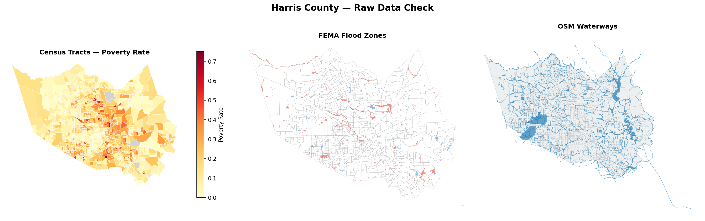
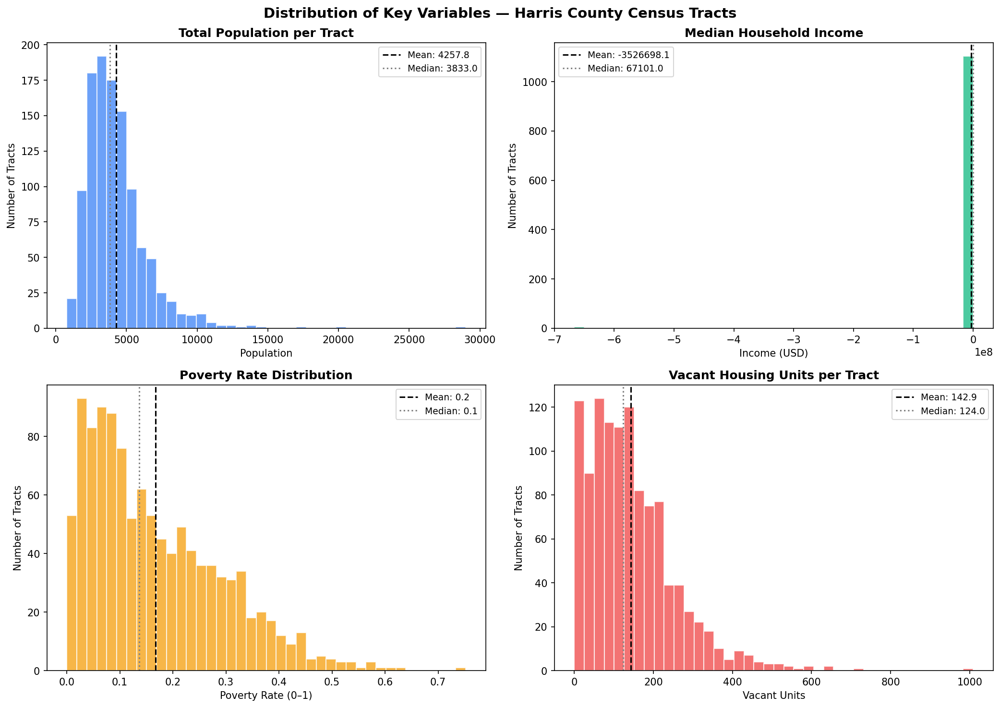
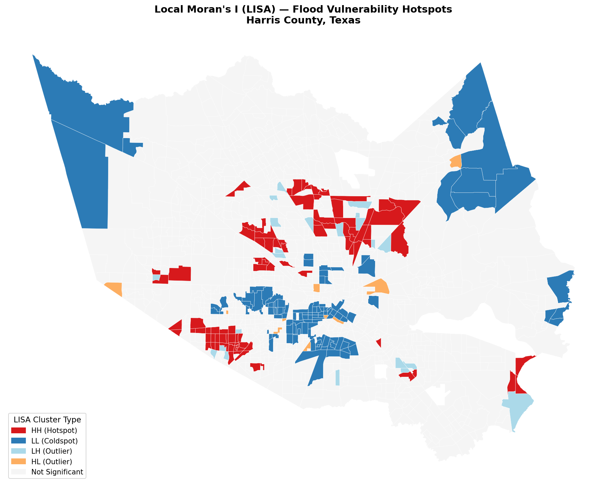
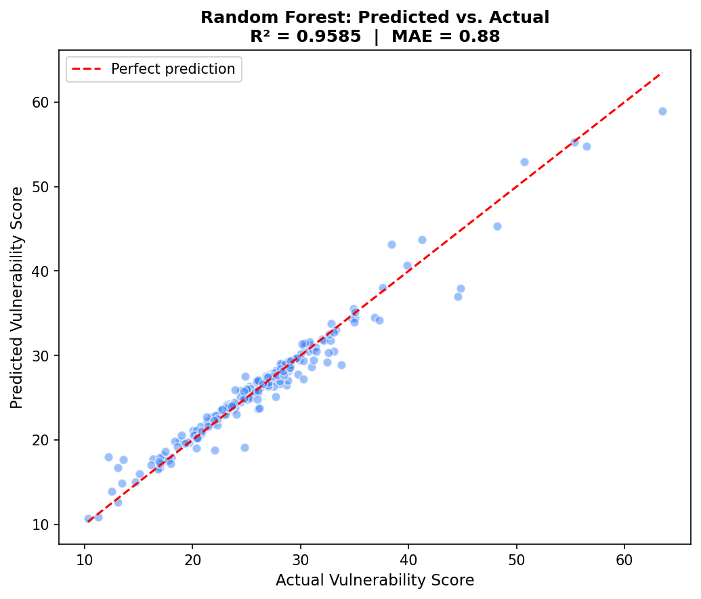
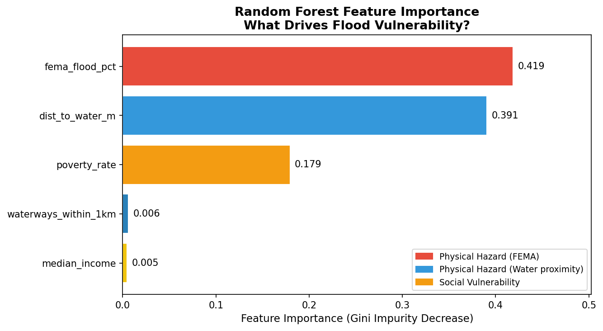

# Harris County Flood Risk Intelligence Dashboard
### Urban Flood Risk & Vulnerability Mapping — P01 + Production Web Application


This repository contains two complementary notebooks and a full-stack web deployment for flood risk analysis in Harris County, TX:

- **`Urban_Flood_Risk.ipynb`** — the original P01 analysis: census tract–level vulnerability scoring, spatial autocorrelation (Moran's I / LISA), Random Forest regression, and an interactive Folium map
- **`flood_risk_dashboard_pipeline.ipynb`** — the upgraded P01 pipeline: block group–level Random Forest classification with SHAP explainability, producing GeoJSON + KPI outputs for a live FastAPI + ArcGIS Maps SDK dashboard

**Portfolio Project P01** · Harris County, TX

---

## Live Dashboard

> 📍 **[Launch the Flood Risk Intelligence Dashboard](https://flood-risk-dashboard-wdjy.onrender.com/)**

*Click any block group to see its SHAP feature contributions — the model's explanation of why that neighborhood has its risk score. Toggle FEMA flood zones as a comparison layer.*

> 📍 **[View the Original Folium Flood Risk Map](https://Suvamp.github.io/urban-flood-risk-harris-county/outputs/flood_vulnerability_harris_county.html)**

*Hover over any census tract to see its vulnerability score, risk tier, poverty rate, and distance to nearest waterway. Toggle the LISA cluster layer on/off using the layer control.*

---

## Dashboard Features

| Panel | Description |
|-------|-------------|
| **Choropleth Map** | ArcGIS Maps SDK 4.29 — 2,830 block groups colored by RF risk score (5-class yellow → dark red). Layer toggles for FEMA zones. |
| **KPI Cards** | County-wide summary: population in SFHA, % land area high-risk, critical facilities exposed, median RF risk score |
| **SHAP Chart** | Click any block group → horizontal bar chart showing each feature's contribution to that specific prediction (red = increases risk, green = decreases) |
| **Vulnerability Scatter** | Risk score vs. median income — bubble size = population. Quadrant lines highlight the high-risk / low-income priority zones |

---

## Key Results

### Original Analysis — Census Tract Level (`Urban_Flood_Risk.ipynb`)

| Metric | Value |
|--------|-------|
| Census tracts analyzed | 1,110 |
| FEMA flood zone polygons | 750 |
| OSM waterway features | 12,742 |
| Global Moran's I | **0.3916** (p = 0.001) |
| LISA hotspot tracts (HH) | 91 |
| LISA coldspot tracts (LL) | 116 |
| Random Forest R² | **0.9585** |
| Mean Absolute Error | **0.88 / 100 points** |
| High / Very High risk tracts | 6 (0.5%) |

**Environmental justice signal:** High-risk tracts have a mean poverty rate of 29.2% versus 11.9% in Very Low risk tracts — a 145% differential.

### Dashboard Pipeline — Block Group Level (`flood_risk_dashboard_pipeline.ipynb`)

| Metric | Value |
|--------|-------|
| Block groups analyzed | 2,830 |
| Population in SFHA | 707,445 |
| Land area high-risk | 5.2% |
| Median RF risk score | 0.279 |
| High-risk block groups | 1,145 / 2,830 (40%) |
| Random Forest trees | 300 |
| Features | 7 normalized (elevation, imperviousness, waterway proximity, FEMA zone, income, renter %, pop density) |

---

## Visualizations

### Original Analysis

#### Raw Data — FEMA Flood Zones, Census Tracts & Waterways


#### Variable Distributions — Harris County Census Tracts


#### Local Moran's I (LISA) — Flood Vulnerability Hotspots

*Red = HH hotspots (high vulnerability clustered together). Blue = LL coldspots. Clusters follow the Buffalo Bayou and Brays Bayou corridors through central Houston.*

#### Random Forest — Predicted vs. Actual Vulnerability Score


#### Feature Importance — What Drives Flood Vulnerability?

*FEMA flood zone coverage (0.419) and distance to water (0.391) together account for 81% of model explanatory power. Poverty rate (0.179) is the strongest socioeconomic signal.*

### Dashboard Pipeline

#### Risk Score Distribution & FEMA Zone Validation


#### Feature Importances & Mean SHAP Values


---

## Repository Structure

```
Project 1 - Urban Flood Risk/
│
├── Urban_Flood_Risk.ipynb               # Original P01 — census tract analysis
├── flood_risk_dashboard_pipeline.ipynb  # Upgraded pipeline — block group + SHAP
├── environment.yml                      # Conda environment (flood-dashboard)
├── README.md
│
├── backend/
│   ├── main.py                          # FastAPI app — 5 endpoints
│   ├── requirements.txt                 # pip dependencies for Render deployment
│   └── data/                            # Generated by notebook (gitignored if large)
│       ├── harris_risk.geojson          # 2,830 BGs with RF scores + SHAP columns
│       ├── harris_kpis.json             # County-wide KPI summary
│       ├── fema_zones.geojson           # FEMA flood zone toggle layer
│       └── flood_rf_model.joblib        # Trained Random Forest model
│
├── frontend/
│   ├── index.html                       # Dashboard shell — structure only
│   └── assets/
│       ├── dashboard.css                # All styles + CSS custom properties
│       └── dashboard.js                 # ArcGIS + Plotly logic, API calls
│
└── outputs/                             # Original P01 static analysis outputs
    ├── 01_raw_data_check.png
    ├── 02_distributions.png
    ├── 03_lisa_map.png
    ├── 04_predictions_vs_actual.png
    ├── 05_feature_importance.png
    └── flood_vulnerability_harris_county.html  # Interactive Folium map
```

---

## Methodology

### Original Analysis — `Urban_Flood_Risk.ipynb`

#### Data Sources

| Dataset | Source | Records |
|---------|--------|---------|
| FEMA NFHL | ArcGIS Online / hazards.fema.gov | 750 polygons |
| Census ACS 5-Year (2022) | api.census.gov | 1,115 tracts |
| OpenStreetMap Waterways | OSMnx | 12,742 features |

#### Pipeline Steps

**1. Data Acquisition** — FEMA NFHL flood zones (AE, AO, VE, A, X), Census tract boundaries + ACS demographics, OSM rivers/streams/bayous via OSMnx

**2. Spatial Feature Engineering**
- `fema_flood_pct` — fraction of each tract's area within a high-risk FEMA flood zone (overlay intersection)
- `dist_to_water_m` — distance in meters from each tract centroid to the nearest waterway (mean: 420m)
- `waterways_within_1km` — count of OSM waterway features within a 1km buffer (mean: 7.4)
- `poverty_rate` / `median_income` — ACS socioeconomic vulnerability indicators

**3. Composite Vulnerability Score (Target Variable)**

A rule-based score (0–100) combining four components:
```
40% × FEMA flood zone coverage  (physical hazard)
25% × Proximity to water        (physical hazard, inverted)
15% × Waterway density          (physical hazard)
20% × Poverty rate              (social vulnerability)
```

**4. Spatial Autocorrelation Analysis**
- Global Moran's I = **0.3916** (p = 0.001) — statistically significant positive clustering
- LISA identifies **91 HH hotspot** and **116 LL coldspot** tracts following the Buffalo Bayou and Brays Bayou corridors

**5. Random Forest Regression**
- 200 trees, max depth 8, trained on 888 tracts / tested on 222 tracts
- R² = **0.9585**, MAE = **0.88 score points**
- Top predictors: `fema_flood_pct` (0.419), `dist_to_water_m` (0.391), `poverty_rate` (0.179)

**6. Interactive Web Map** — Folium choropleth with hover tooltips, toggleable LISA cluster overlay

---

### Dashboard Pipeline — `flood_risk_dashboard_pipeline.ipynb`

#### Data Sources

| Dataset | Source | Notes |
|---------|--------|-------|
| FEMA NFHL | [msc.fema.gov](https://msc.fema.gov/portal) | S_FLD_HAZ_AR layer |
| Census ACS 5-Year | [api.census.gov](https://api.census.gov) | B19013 income, B25003 tenure, B01003 population |
| USGS 3DEP Elevation | py3dep | 30m DEM, zonal mean per block group |
| NLCD Impervious Surface | [mrlc.gov](https://www.mrlc.gov) | 2021 developed imperviousness |
| NHD Waterways | pynhd | Distance to nearest flowline |
| HIFLD Critical Facilities | ArcGIS Online | Hospitals, fire stations, schools |
| Census TIGER/Line | census.gov | Block group boundaries, Harris County TX (FIPS 48201) |

> All data sources have synthetic fallbacks — the notebook runs end-to-end in any environment including Google Colab.

#### Feature Engineering

All features are min-max normalized to [0, 1] where **1 = highest flood risk**. Features where higher values indicate lower risk are inverted.

| Feature | Raw Variable | Direction |
|---------|-------------|-----------|
| `f_elevation` | Mean elevation (m) | Inverted — low elevation = high risk |
| `f_impervious` | % impervious surface | Direct — high imperviousness = high risk |
| `f_waterway` | Distance to nearest waterway (m) | Inverted — proximity = high risk |
| `f_fema` | FEMA zone risk encoding | Direct — AE=1.0, X=0.05 |
| `f_income` | Median household income | Inverted — low income = high vulnerability |
| `f_renters` | % renter-occupied units | Direct — renters = higher vulnerability |
| `f_popdensity` | Population density (per km²) | Direct — dense = more exposure |

#### Model

- **Random Forest Classifier** — 300 trees, max depth 10, class-weight balanced, `n_jobs=-1`
- **Training target** — binary high/low risk label from 60th percentile composite score cutoff
- **SHAP** — TreeExplainer, per-block-group contributions stored in GeoJSON export columns

#### Dashboard Architecture

```
┌─────────────────────────────────────────────────────────┐
│  Jupyter Notebook Pipeline                               │
│  FEMA · Census ACS · USGS 3DEP · NHD · NLCD · HIFLD    │
│  → Feature Engineering → Random Forest → SHAP           │
│  → harris_risk.geojson · harris_kpis.json                │
└────────────────────┬────────────────────────────────────┘
                     │
┌────────────────────▼────────────────────────────────────┐
│  FastAPI Backend                                         │
│  GET /api/kpis              → KPI summary cards         │
│  GET /api/risk-geojson      → Choropleth GeoJSON        │
│  GET /api/block-group/{id}  → SHAP detail per BG        │
│  GET /api/scatter           → Vulnerability scatter     │
│  GET /api/fema-geojson      → FEMA zone toggle layer   │
└────────────────────┬────────────────────────────────────┘
                     │
┌────────────────────▼────────────────────────────────────┐
│  Frontend  (HTML · CSS · JS)                             │
│  ArcGIS Maps SDK 4.29 · Plotly.js                       │
│  60% map / 40% right panel                              │
└──────────────────────────────────────────────────────────┘
                     │
              Render.com (free tier)
```

---

## Getting Started

### Environment Setup

```bash
conda create -n flood-dashboard python=3.11 \
  geopandas rasterio rioxarray fiona shapely pyproj \
  scikit-learn pandas matplotlib seaborn \
  jupyterlab ipykernel -c conda-forge -y

conda activate flood-dashboard

pip install fastapi "uvicorn[standard]" shap pynhd py3dep \
  census folium plotly nbformat "numpy>=2.0"

python -m ipykernel install --user --name flood-dashboard \
  --display-name "Python (flood-dashboard)"
```

### Run the Original Analysis

```bash
jupyter lab Urban_Flood_Risk.ipynb
# Run all cells — outputs saved to outputs/
```

### Run the Dashboard Pipeline

```bash
# 1. Run notebook to generate GeoJSON outputs in backend/data/
jupyter lab flood_risk_dashboard_pipeline.ipynb

# 2. Start the API
uvicorn backend.main:app --reload

# 3. Serve the frontend (separate terminal)
cd frontend && python3 -m http.server 3000
```

Open `http://localhost:3000`.

### Census API Key (optional)

Real ACS data requires a free key from [api.census.gov/data/key_signup.html](https://api.census.gov/data/key_signup.html):

```bash
export CENSUS_API_KEY=your_key_here
```

Without a key, the notebook generates spatially realistic synthetic demographics.

---

## Deployment (Render.com)

```yaml
# render.yaml
services:
  - type: web
    name: flood-risk-api
    env: python
    buildCommand: pip install -r backend/requirements.txt
    startCommand: uvicorn backend.main:app --host 0.0.0.0 --port $PORT
    envVars:
      - key: PYTHON_VERSION
        value: 3.11.0

  - type: web
    name: flood-risk-dashboard
    env: static
    staticPublishPath: ./frontend
    routes:
      - type: rewrite
        source: /api/*
        destination: https://flood-risk-api.onrender.com/api/:splat
```

Push to `main` → Render auto-deploys both services.

---

## Skills Demonstrated

**Original Analysis:** GeoPandas · spatial joins & overlay · buffer analysis · spatial autocorrelation (Moran's I / LISA) · Random Forest regression · interactive web mapping (Folium) · Census & FEMA API pipelines

**Dashboard Upgrade:** FastAPI · ArcGIS Maps SDK 4.29 · SHAP explainability · GeoJSON API design · Plotly.js · ES module frontend architecture · Render.com deployment · USGS 3DEP elevation · NHD hydrography · NLCD impervious surface

---

## Limitations

1. **Synthetic target variable** — The vulnerability score is constructed from the same spatial features used to predict it. A production model would use historical FEMA flood insurance claims or disaster declarations as ground truth.
2. **Random train/test split** — Adjacent block groups share spatial characteristics. Spatial k-fold cross-validation would give a more conservative performance estimate.
3. **Static snapshot** — ACS data is a 5-year rolling average and does not capture recent population or income shifts.
4. **MAUP** — Results may differ at the census tract or ZIP code level (Modifiable Areal Unit Problem).
5. **No real-time hazard data** — Does not incorporate precipitation forecasts, stream gauge readings, or NOAA flood watches.

---

## Portfolio Context

This project is **Project 01** in a GIS Data Science Portfolio series demonstrating applied geospatial analysis for roles in regional planning agencies (SCAG, RCTC, county GIS departments), emergency management and hazard mitigation, and geospatial data science.

---

## License

MIT License — free to use, adapt, and build upon with attribution.

*Suvam S. Patel · [github.com/Suvamp](https://github.com/Suvamp)*